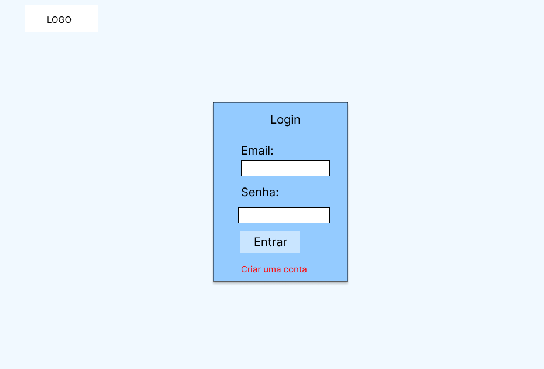
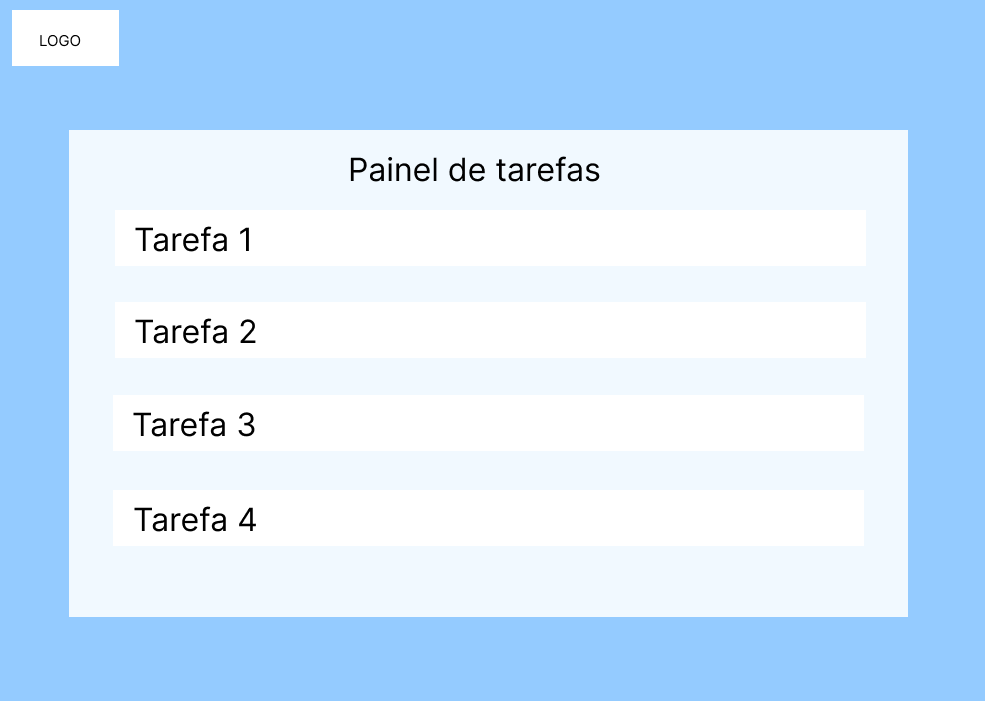

# Projeto: Aplicação Web de To-Do List para a Escola SENAI

## 1. Objetivo
Desenvolver uma aplicação web de To-Do List utilizando tecnologias modernas e práticas de mercado, garantindo segurança, escalabilidade e uma experiência de usuário fluida. Este projeto visa auxiliar os colaboradores da Escola SENAI a organizar suas tarefas de forma eficiente e segura.

## 2. Escopo do Projeto

### 2.1 O que Vamos Fazer
Este projeto consiste na criação de uma aplicação web completa para gerenciar listas de tarefas (To-Do List). A aplicação será desenvolvida utilizando React no front-end, Node.js e MongoDB no back-end, e JWT para autenticação.

### 2.2 Escopo Funcional
- **Cadastro e Autenticação de Usuários:**
  - Usuários podem se registrar com e-mail e senha.
  - Autenticação utilizando JWT.
- **Gerenciamento de Tarefas:**
  - Criar, editar, e excluir tarefas.
  - Marcar tarefas como concluídas.
  - Organizar tarefas por prioridade e prazo.
  - Filtros para visualizar tarefas concluídas ou pendentes.
- **Perfil do Usuário:**
  - Atualizar informações de perfil (nome, e-mail, senha).
  - Visualizar histórico de tarefas concluídas.
- **Notificações:**
  - Alertas para tarefas próximas ao prazo de conclusão.

### 2.3 Escopo Não Funcional
- **Segurança:**
  - Uso de HTTPS para todas as comunicações.
  - Senhas armazenadas de forma segura com hashing.
  - Implementação de autenticação JWT para proteger as rotas.
- **Escalabilidade:**
  - Arquitetura baseada em microserviços.
  - Banco de dados escalável (MongoDB) para suportar crescimento de usuários.
- **Performance:**
  - Otimização de carregamento da aplicação com Lazy Loading.
  - Uso de caching para melhorar a resposta do servidor.
- **Experiência do Usuário:**
  - Interface intuitiva e responsiva, compatível com dispositivos móveis.
  - Feedback visual imediato em ações como criação e exclusão de tarefas.

## 3. Objetivos SMART
- **S** (Specific): Desenvolver uma aplicação web de To-Do List com autenticação de usuários, gerenciamento de tarefas, e perfil de usuário.
- **M** (Measurable): A aplicação deve ser capaz de suportar pelo menos 10.000 usuários simultâneos sem degradação de performance.
- **A** (Achievable): Com a equipe e recursos disponíveis, o projeto será concluído em 3 meses.
- **R** (Relevant): A aplicação ajudará os colaboradores da Escola SENAI a gerenciar suas tarefas de maneira mais eficiente.
- **T** (Time-bound): O desenvolvimento será concluído até o final do trimestre atual.

## 4. Cronograma e Diagramas
Um cronograma detalhado será criado utilizando o diagrama de Gantt, com as seguintes fases principais:
- **Semana 1-2:** Planejamento e definição de requisitos
- **Semana 3-6:** Desenvolvimento do Back-end (Node.js, MongoDB)
- **Semana 7-10:** Desenvolvimento do Front-end (React)
- **Semana 11:** Testes e ajustes
- **Semana 12:** Deploy e documentação

## 4.1 Diagrama de Fluxo

## 4.2 Diagrama de Casos de Uso

|------------------------------|
| **Descrição Geral**          |
|------------------------------|
| O Diagrama de Casos de Uso   |
| apresenta as principais      |
| interações dos usuários com  |
| a aplicação. Neste diagrama, |
| estão representados os       |
| diferentes usuários e os     |
| casos de uso que descrevem   |
| as funcionalidades que eles  |
| podem acessar.               |
|------------------------------|

|------------------------------|
| **Elementos Principais**     |
|------------------------------|
| **Usuários:**                |
| - **Usuário:** Representa    |
| qualquer colaborador da      |
| Escola SENAI que utiliza a   |
| aplicação.                   |
| - **Admin:** Usuário com     |
| permissões especiais para    |
| gerenciar a aplicação.       |
|------------------------------|
| **Casos de Uso:**            |
| - **Registrar:** O usuário   |
| pode se registrar na         |
| aplicação criando uma nova   |
| conta.                       |
| - **Login:** Autenticação do |
| usuário utilizando e-mail e  |
| senha.                       |
| - **Gerenciar Tarefas:**     |
|   - **Criar Tarefa:** O      |
|   usuário pode criar uma     |
|   nova tarefa na sua lista.  |
|   - **Editar Tarefa:** O     |
|   usuário pode modificar uma |
|   tarefa existente.          |
|   - **Excluir Tarefa:** O    |
|   usuário pode remover uma   |
|   tarefa da lista.           |
|   - **Marcar Tarefa como     |
|   Concluída:** O usuário     |
|   pode marcar uma tarefa     |
|   como finalizada.           |
| - **Organizar Tarefas:** O   |
| usuário pode organizar       |
| tarefas por prioridade e     |
| prazo.                       |
| - **Filtrar Tarefas:** O     |
| usuário pode aplicar filtros |
| para visualizar apenas       |
| tarefas concluídas ou        |
| pendentes.                   |
| - **Gerenciar Perfil:**      |
| - **Atualizar Informações:** |
|   O usuário pode atualizar   |
|   nome, e-mail e senha.      | 
|  - **Visualizar Histórico:** |
|   O usuário pode ver o       |
|   histórico de tarefas       |
|   concluídas.                |
| - **Receber Notificações:**  |
| O usuário recebe alertas     |
| sobre tarefas próximas do    |
| prazo de conclusão.          |
|------------------------------|

## 4.3 Diagrama de Classes

|------------------------------|
| **Descrição Geral**          |
|------------------------------|
| O Diagrama de Classes        |
| representa a estrutura de    |
| classes no sistema,          |
| mostrando as relações entre  |
| elas, seus atributos e       |
| métodos. É fundamental para  |
| a modelagem do sistema no    |
| back-end.                    |
|------------------------------|

|------------------------------|
| **Elementos Principais**     |
|------------------------------|
| **Classes:**                 |
|------------------------------|
| **Usuario:**                 |
|   - **Atributos:**           |
|     - `id`                   |
|     - `nome`                 |
|     - `email`                |
|     - `senha`                |
|   - **Métodos:**             |
|     - `registro()`           |
|     - `login()`              |
|------------------------------|
| **Task:**                    |
|   - **Atributos:**           |
|     - `id`                   |
|     - `title`                |
|     - `description`          |
|     - `dueDate`              |
|     - `priority`             |
|     - `status` (pendente/    |
|       concluída)             |
|     - `userId`               |
|   - **Métodos:**             |
|     - `createTask()`         |
|     - `editTask()`           |
|     - `deleteTask()`         |
|     - `markAsCompleted()`    |
|     - `filterTasks()`        |
|------------------------------|
| **Notification:**            |
|   - **Atributos:**           |
|     - `id`                   |
|     - `message`              |
|     - `taskId`               |
|     - `userId`               |
|     - `sentAt`               |
|   - **Métodos:**             |
|     - `sendNotification()`   |
|------------------------------|

## 5. Análise de Risco
- **Risco de Segurança:** Vulnerabilidades no sistema de autenticação. **Mitigação:** Revisões de código e testes de penetração.
- **Risco de Escopo:** Possível aumento no escopo conforme necessidades dos usuários. **Mitigação:** Revisões regulares do escopo e gerenciamento de mudanças.
- **Risco de Prazo:** Atrasos no desenvolvimento devido à complexidade técnica. **Mitigação:** Cronograma flexível e priorização das funcionalidades essenciais.
- **Risco de Performance:** Degradação da performance com aumento de usuários. **Mitigação:** Testes de carga e otimização contínua.

## 6. Recursos
- **Equipe:**
  - 1 Gerente de Projeto
  - 2 Desenvolvedores Full Stack
  - 1 Designer de UX/UI
  - 1 Especialista em Segurança
  - 1 Tester QA
- **Tecnologias:**
  - **Front-end:** React, HTML, CSS, JavaScript
  - **Back-end:** Node.js, Express.js
  - **Banco de Dados:** MongoDB
  - **Autenticação:** JWT
  - **Deploy:** AWS ou Heroku

## 7. Prototipagem

## 8. Observações
Este escopo será atualizado conforme o andamento do projeto e novas necessidades sejam identificadas. O progresso será documentado e acompanhado através do repositório no GitHub, onde serão mantidos todos os registros e artefatos do projeto.

