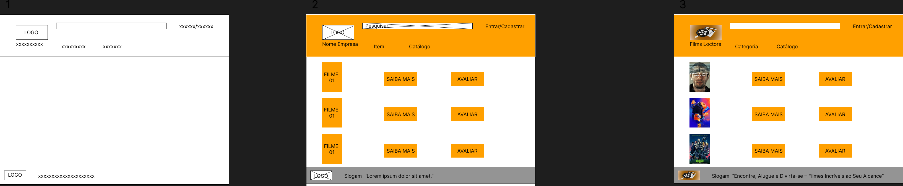

Escopo do Projeto
Objetivo do Projeto: Desenvolver um Catálogo de Filmes para a Films Locators que permitirá aos clientes descobrir, avaliar e interagir com filmes de maneira intuitiva e interativa. O sistema será integrado ao sistema de recomendação da empresa e melhorará a experiência do usuário na busca e seleção de filmes.
Escopo Inclui:
Interface do Usuário:
Página inicial com destaque para filmes populares e novos lançamentos.
Páginas de detalhes dos filmes com sinopses, avaliações e recomendações relacionadas.
Funcionalidades de busca e filtragem avançada.
Sistema de avaliação e comentários dos usuários.
Funcionalidades do Sistema:
Integração com o sistema de recomendação existente.
Gerenciamento de conteúdo para adicionar, editar e remover filmes.
Sistema de autenticação de usuários e gerenciamento de perfis.
Relatórios e análises sobre o uso do catálogo.
Tecnologia:
Desenvolvimento web responsivo.
Backend em [especificar linguagem e framework, ex: Node.js, Django].
Banco de dados relacional [especificar, ex: PostgreSQL, MySQL].
Entregáveis:
Protótipos de baixa, média e alta fidelidade.
Documentação técnica e do usuário.
Plano de testes e relatórios de QA.
Escopo Não Inclui:
Funcionalidades de streaming de filmes.
Integração com serviços externos de pagamento ou compra.

Objetivos SMART
Específico: Desenvolver um Catálogo de Filmes que permita aos usuários descobrir, avaliar e interagir com filmes.
Mensurável: Concluir o desenvolvimento e lançar o Catálogo de Filmes em 6 meses. O sucesso será medido por um aumento de 20% no engajamento dos usuários com o sistema de recomendação nos primeiros 3 meses pós-lançamento.
Atingível: O projeto será realizado por uma equipe de desenvolvedores, designers e testadores, com a tecnologia e ferramentas já disponíveis.
Relevante: Melhorar a experiência do usuário e otimizar a oferta de conteúdo em resposta à crescente demanda dos clientes.
Temporal: Lançar o Catálogo de Filmes até o final do mês de março de 2025.

Cronograma - Diagrama de Gantt
Fase 1: Planejamento (Setembro 2024)
Definição de Requisitos
Aprovação do Escopo
Planejamento de Recursos
Fase 2: Design (Outubro 2024)
Criação de Protótipos (Baixa, Média, Alta Fidelidade)
Revisões e Aprovações
Fase 3: Desenvolvimento (Novembro 2024 - Janeiro 2025)
Desenvolvimento Frontend e Backend
Integração com Sistema de Recomendação
Implementação de Funcionalidades
Fase 4: Testes (Fevereiro 2025)
Testes de Unidade e Integração
Testes de Usabilidade
Correção de Bugs
Fase 5: Lançamento e Avaliação (Março 2025)
Lançamento do Catálogo
Monitoramento de Desempenho
Coleta de Feedback e Ajustes
Nota: O Diagrama de Gantt visual pode ser criado utilizando ferramentas como Microsoft Project, Trello, ou ferramentas online como GanttPRO.

Análise de Risco
Risco: Atrasos no Desenvolvimento
Mitigação: Estabelecer marcos claros e revisar o progresso semanalmente. Manter comunicação aberta com a equipe e ajustar o cronograma conforme necessário.
Risco: Problemas de Integração
Mitigação: Realizar testes de integração contínuos durante o desenvolvimento e garantir que a equipe tenha conhecimento técnico adequado.
Risco: Feedback Negativo dos Usuários
Mitigação: Conduzir testes de usabilidade com usuários reais e implementar um processo de feedback contínuo para ajustar e melhorar a experiência do usuário.
Risco: Problemas Técnicos ou Falhas de Sistema
Mitigação: Implementar um plano de testes robusto e ter um plano de contingência para resolver problemas rapidamente.
Risco: Limitações de Orçamento ou Recursos
Mitigação: Definir um orçamento claro e alocar recursos de acordo. Monitorar gastos e ajustar conforme necessário.

Recursos
Equipe de Desenvolvimento:
2 Desenvolvedores Backend
2 Desenvolvedores Frontend
1 Designer UX/UI
1 Gerente de Projeto
1 Testador/QA
Tecnologia e Ferramentas:
Software de Design: Figma, Adobe XD
Ferramentas de Desenvolvimento: Visual Studio Code, GitHub
Servidores e Banco de Dados: AWS, PostgreSQL/MySQL
Orçamento:
Custos de Desenvolvimento
Licenças de Software
Testes e Avaliação

Diagrama de classe:

diagrama de fluxo:

diagrama de uso:

Prototipos:
