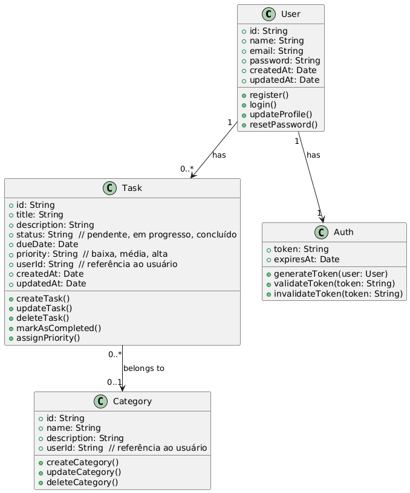
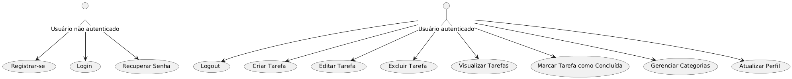
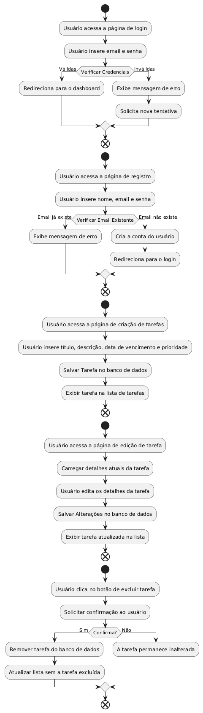

OBJETIVO
Desenvolver uma aplicação web de To-Do List utilizando tecnologias modernas como React, Node.js, MongoDB e JWT, com foco em segurança, escalabilidade e uma experiência de usuário fluida. Este projeto visa aplicar e aprimorar habilidades técnicas para criar uma solução completa e funcional, adequada para uso no mundo real.

----------------------------------------------------------------------------------------------------------------------------------------------------------------
ESCOPO DO PROJETO

Gerenciamento de Tarefas:
Criar, editar, visualizar e excluir tarefas.
Marcar tarefas como concluídas ou pendentes.
Organizar tarefas por categorias ou tags.
Autenticação e Autorização:

Registro de novos usuários.
Login e logout com autenticação via JWT.
Proteção de rotas para usuários autenticados.
Interface do Usuário:

Interface amigável e responsiva, projetada para uma experiência de usuário fluida.
Feedback visual para ações do usuário, como confirmações e notificações de erro.
Gerenciamento de Conta:

Edição de perfil do usuário (nome, email, senha).
Recuperação de senha via email.

----------------------------------------------------------------------------------------------------------------------------------------------------------------
OBJETIVOS SMART

Específico: Desenvolver uma aplicação To-Do List com funcionalidades completas de gerenciamento de tarefas e autenticação segura.
Mensurável: Concluir o desenvolvimento em 12 semanas, com 100% das funcionalidades testadas e funcionando.
Alcançável: Utilizar tecnologias e práticas já conhecidas e aplicadas pelo time.
Relevante: Criar uma aplicação que pode ser utilizada por usuários reais e que melhora a produtividade.
Temporal: Lançar a versão final em até 3 meses, com entregas parciais a cada 2 semanas.

----------------------------------------------------------------------------------------------------------------------------------------------------------------

CRONOGRAMA
Um diagrama de Gantt pode ser utilizado para visualizar o cronograma. Aqui está um exemplo simplificado das etapas principais:
Planejamento e Definição do Escopo 2 semanas
Planejamento e Definição do Escopo 1 semana
Desenvolvimento Backend 2 semanas
Desenvolvimento Frontend 2 semanas
Integração Frontend/Backend 2 semanas
Testes e Ajustes Finais	2 semanas
Lançamento e Documentação 2 semanas

----------------------------------------------------------------------------------------------------------------------------------------------------------------
ANÁLISE DE RISCO
Risco: Atraso no desenvolvimento backend.
Mitigação: Estabelecer milestones semanais e fazer revisões regulares.

Risco: Problemas de performance devido à carga de usuários.
Mitigação: Implementar testes de carga e otimizações de código durante o desenvolvimento.

Risco: Falhas na integração entre frontend e backend.
Mitigação: Testar a integração em fases iniciais e corrigir problemas à medida que surgem.

----------------------------------------------------------------------------------------------------------------------------------------------------------------
RECURSOS
Pessoal:

Desenvolvedor Frontend: 1
Desenvolvedor Backend: 1
Designer UI/UX: 1
Testador QA: 1
Tecnologia:

Frontend: React, CSS, HTML
Backend: Node.js, Express
Banco de Dados: MongoDB
Autenticação: JWT
Controle de Versão: Git, GitHub
Hospedagem: Heroku ou AWS
Ferramentas:

IDEs: VSCode
Comunicação: Trello para gerenciamento de tarefas
Testes: Jest, Postman para testes de API

----------------------------------------------------------------------------------------------------------------------------------------------------------------

Diagrama de classe

----------------------------------------------------------------------------------------------------------------------------------------------------------------

Diagrama de Casos de Uso

----------------------------------------------------------------------------------------------------------------------------------------------------------------

Diagrama de Fluxo

